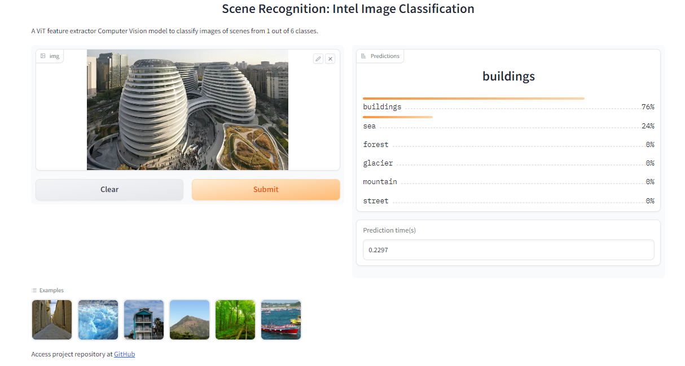
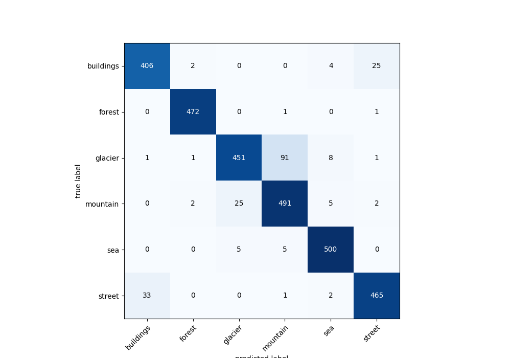

# Intel Image Classification using Vision Transformer (ViT)

This repository contains the code implementation of Intel Image Classification using the Vision Transformer (ViT) model. The ViT model is based on the "An Image is Worth 16x16 Words" paper, and we utilize the ViT Base architecture for this task.

I have written a blogpost which guides you through the code. It can be accesed on [medium](https://github.com/Ammar2k/intel_image_classification.git).

## Deployed Application

The model is hosted on [Hugging Face Spaces](https://huggingface.co/spaces/ammar2k/scene_recognition) using Gradio.

### 

## Dataset

The dataset used for this project is the Intel Image Classification dataset, which consists of various classes of objects, including electronic components. The dataset is organized into the following directories:

- Training images directory: `scenes/seg_train`
- Testing images directory: `scenes/seg_test`

Ensure that you have the dataset arranged in the above directory structure before running the code.

The Intel Image Classification dataset can be found on Kaggle: [Intel Image Classification](https://www.kaggle.com/puneet6060/intel-image-classification).


## Code Structure

- `data_exploration.ipynb`: This Jupyter notebook focuses on data exploration and preparation. It includes the following steps:
  - Loading and visualizing the dataset.
  - Dividing the images into patches according to the ViT paper.
  - Applying convolution to create patches and flattening them to convert them into linear embeddings.
  - Adding the class token and positional embeddings as described in the paper.
  - Replicating the ViT Base architecture from scratch.

- `fine_tuning_and_analysis.ipynb`: This notebook covers fine-tuning the pre-trained ViT model and analyzing the results. It includes the following steps:
  - Loading the pre-trained ViT Base model weights from torchvision.
  - Setting all layers, except the final MLP, as non-trainable.
  - Fine-tuning the model on our dataset.
  - Visualizing the images on which the model made incorrect predictions.
  - Plotting a confusion matrix to evaluate the performance of the model.

## Clone the repository

```shell
git clone https://github.com/your-username/intel-image-classification.git
```

## Results
Here are some results achieved using the Vision Transformer model on the Intel Image Classification dataset:
### Accuracy: 92.8%
### Confusion Matrix: 
